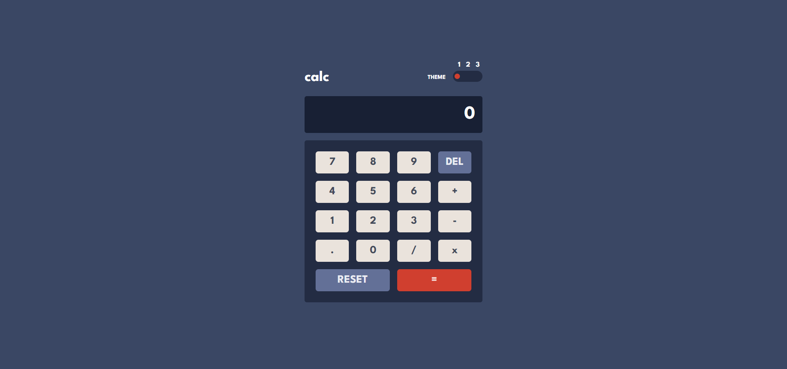

# Frontend Mentor - Calculator app solution

This is a solution to the [Calculator app challenge on Frontend Mentor](https://www.frontendmentor.io/challenges/calculator-app-9lteq5N29). Frontend Mentor challenges help you improve your coding skills by building realistic projects.

## Table of contents

-   [Overview](#overview)
    -   [The challenge](#the-challenge)
    -   [Screenshot](#screenshot)
    -   [Links](#links)
-   [My process](#my-process)
    -   [Built with](#built-with)
    -   [What I learned](#what-i-learned)
    -   [Continued development](#continued-development)
    -   [Useful resources](#useful-resources)
-   [Author](#author)

## Overview

### The challenge

Users should be able to:

-   See the size of the elements adjust based on their device's screen size
-   Perform mathmatical operations like addition, subtraction, multiplication, and division
-   Adjust the color theme based on their preference
-   **Bonus**: Have their initial theme preference checked using `prefers-color-scheme` and have any additional changes saved in the browser

### Screenshot



### Links

-   Solution URL: [Github repo](https://github.com/Robertron624/calculator-app-with-themes)
-   Live Site URL: [Add live site URL here](https://your-live-site-url.com)

## My process

### Built with

-   Semantic HTML5 markup
-   CSS custom properties
-   Flexbox
-   CSS Grid
-   Mobile-first workflow
-   [React](https://reactjs.org/) - JS library
-   [Saas](https://sass-lang.com/) - For styles
-   [Typescript](https://www.typescriptlang.org/) - For type checking

### What I learned

With this project I learned how to create a theme switcher with React and Typescript using attributes and CSS variables. I also learned how to use the `prefers-color-scheme` media query to check the user's preference and set the theme accordingly.

The theme colors are stored in CSS variables and the theme is set using the `data-theme` attribute in the body tag.
```css
body[data-theme="theme1"] {
    --main-background: hsl(222, 26%, 31%);
    --keyboard-background: hsl(223, 31%, 20%);
    --screen-background: hsl(224, 36%, 15%);
    --del-key-background: hsl(225, 21%, 49%);
    --del-key-shadow: hsl(224, 28%, 35%);
    --equal-key-background: hsl(6, 63%, 50%);
    --equal-key-shadow: hsl(25, 99%, 27%);
    --normal-key-background: hsl(30, 25%, 89%);
    --normal-key-shadow: hsl(28, 16%, 65%);
    --normal-key-text: hsl(221, 14%, 31%);
    --dark-text: hsl(221, 14%, 31%);
    --main-text: hsl(0, 0%, 100%);

    --switcher-background: hsl(223, 31%, 20%);
    --switcher-circle: hsl(6, 63%, 50%);

    --normal-key-hover: hsl(0, 0%, 100%);
    --del-key-hover: hsl(224, 51%, 76%);

    --equal-key-hover: hsl(6, 93%, 67%);
}

body[data-theme="theme2"] {
    --main-background: hsl(0, 0%, 90%);
    --keyboard-background: hsl(0, 5%, 81%);
    --screen-background: hsl(0, 0%, 93%);
    --del-key-background: hsl(185, 42%, 37%);
    --del-key-shadow: hsl(185, 58%, 25%);
    --equal-key-background: hsl(25, 98%, 40%);
    --equal-key-shadow: hsl(25, 99%, 27%);
    --normal-key-background: hsl(45, 7%, 89%);
    --normal-key-shadow: hsl(35, 11%, 61%);
    --normal-key-text: hsl(60, 10%, 19%);
    --main-text: hsl(60, 10%, 19%);
    --light-text: hsl(0, 0%, 100%);

    --switcher-background: hsl(0, 5%, 81%);
    --switcher-circle: hsl(25, 98%, 40%);

    --normal-key-hover: hsl(0, 0%, 100%);
    --del-key-hover: hsl(185, 41%, 56%);

    --equal-key-hover: hsl(25, 100%, 61%);
}

body[data-theme="theme3"] {
    --main-background: hsl(268, 75%, 9%);
    --keyboard-background: hsl(268, 71%, 12%);
    --screen-background: hsl(268, 71%, 12%);
    --del-key-background: hsl(281, 89%, 26%);
    --del-key-shadow: hsl(285, 91%, 52%);
    --equal-key-background: hsl(176, 100%, 44%);
    --equal-key-shadow: hsl(177, 92%, 70%);
    --normal-key-background: hsl(268, 47%, 21%);
    --normal-key-shadow: hsl(290, 70%, 36%);
    --normal-key-text: hsl(52, 100%, 62%);
    --main-text: hsl(52, 100%, 62%);
    --light-text: hsl(198, 20%, 13%);

    --switcher-background: hsl(268, 71%, 12%);
    --switcher-circle: hsl(176, 100%, 44%);

    --normal-key-hover: hsl(268, 54%, 44%);
    --del-key-hover: hsl(280, 56%, 44%);

    --equal-key-hover: hsl(177, 100%, 79%);
}
```

The code to calculate the result of the operation and formating to max 3 decimal places is the following:
```ts
    const handleEqual = () => {
        if (!firstNumber || !secondNumber || !operation) return;

        const first = Number(firstNumber);
        const second = Number(secondNumber);

        let result = 0;

        switch (operation) {
            case "+":
                result = first + second;
                break;
            case "-":
                result = first - second;
                break;
            case "x":
                result = first * second;
                break;
            case "/":
                result = first / second;
                break;
            default:
                break;
        }

        // limit to 3 decimal places after the dot
        if (result.toString().includes(".")) {
            const [integer, decimal] = result.toString().split(".");
            result = Number(`${integer}.${decimal.slice(0, 3)}`);
        }

        setResult(result.toString());
        setScreen(result.toString());
    };
```

### Continued development

At this time this is almost the last medium difficulty challenge I have to complete. I will continue to do more challenges to improve my skills and learn new things with the advance ones.

### Useful resources

-   [An Easy Way to Add Multiple Themes in a React App](https://javascript.plainenglish.io/easy-way-to-add-multiple-themes-in-react-app-ff45eeca67cb) - This helped me for adding multiple themes in my app. It works without the needing of a preproccesor like sass. -EN-

-   [Personalizar un radio button con CSS](https://www.antofernandez.com/personalizar-radio-buttons-css/) - This is an amazing article to understand how to customize radio buttons with CSS. -ES-

## Author

-   Personal Website - [Robert Ramirez](https://robert-ramirez.netlify.app)
-   Frontend Mentor User- [@Robertron624](https://www.frontendmentor.io/profile/Robertron624)
-   Twitter - [@robertdowny](https://www.twitter.com/robertdowny)